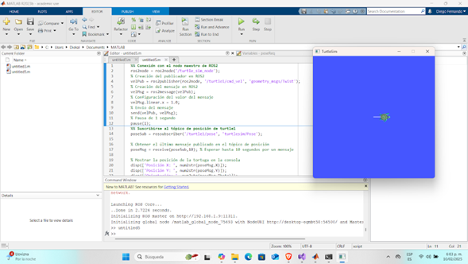
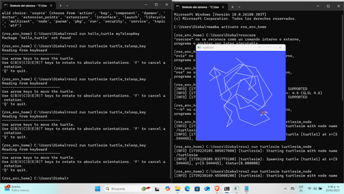

# Laboratorio N° 03 - 2024-II - Robótica de Desarrollo, Intro a ROS

Integrantes: Catalina Criollo Castelblanco - Diego Fernando Malagón Saenz

## Proceso de instalación de ROS2.

### Consideraciones previas
Antes de proceder con la instalación, es importante asegurarse de que el nombre de usuario del computador no contenga espacios, ya que esto puede generar problemas en las direcciones de las carpetas.

### Descarga de Miniforge
La instalación de ROS2 se realiza a través de RoboStack (https://robostack.github.io/index.html). En la sección "Getting Started", se encuentra un hipervínculo hacia "miniforge", el cual dirige al sitio donde se puede descargar el instalador minimalista de conda.

En la página de GitHub correspondiente, se debe navegar hasta la sección **Install -> Windows** y hacer clic en el hipervínculo "the Windows installer". Esto descargará el ejecutable **Miniforge3-Windows-x86_64.exe**.

### Instalación de Miniforge
Una vez descargado el instalador, se ejecuta el archivo **Miniforge3-Windows-x86_64.exe**. Durante la instalación, en las opciones avanzadas, se deben seleccionar las siguientes casillas:
- Create shortcuts (supported packages only)
- Add Miniforge3 to my PATH environment variable
- Register Miniforge3 as my default Python 3.12

### Verificación de la instalación
Tras completar la instalación, se debe abrir el sistema de comandos y verificar la instalación de `mamba` y `conda` ejecutando:
```
mamba --version
conda --version
```

### Creación y configuración del entorno
Para preparar un entorno con los canales correctos, se ejecutan las siguientes líneas en el sistema de comandos:
```
mamba create -n ros_env python=3.11
mamba activate ros_env
```
Si se presenta un error en este paso, el sistema de comandos indicará una línea de código que se debe ejecutar para solucionarlo. Luego, se deben volver a ejecutar las líneas anteriores.

Posteriormente, se configuran los canales de conda en el entorno:
```sh
# Agregar el canal conda-forge
conda config --env --add channels conda-forge

# Agregar el canal robostack-staging
conda config --env --add channels robostack-staging

# Agregar el canal de ROS Jazzy (si se desea usar esta versión)
conda config --env --add channels robostack-jazzy

# Eliminar el canal defaults (esto puede generar un error si no está en la lista, lo cual es aceptable)
conda config --env --remove channels defaults
```

### Instalación de ROS2
Para instalar ROS2 Humble en el entorno creado, se ejecuta el siguiente comando:
```sh
mamba install ros-humble-desktop
```

Con esto, se completa la instalación de ROS2 en Windows 11 a través de RoboStack.

## Conexión de ROS2 con Matlab
El objetivo de esta sección fue establecer una comunicación efectiva entre MATLAB y ROS 2 para interactuar con nodos y tópicos en tiempo real. Para esto se siguio con el siguiente procedimiento:

En esta sección del laboratorio, se estableció una comunicación entre ROS 2 y MATLAB con el objetivo de controlar el movimiento de la tortuga en Turtlesim. Se realizaron tres implementaciones principales: envío de comandos de velocidad, suscripción al tópico de posición, y teletransporte de la tortuga a una nueva ubicación.

1. Envío de comandos de velocidad a la tortuga
   
Para controlar el movimiento de la tortuga, se inició un nodo en MATLAB y se configuró un publicador en el tópico /turtle1/cmd_vel, utilizando el tipo de mensaje geometry_msgs/Twist. Se definió un mensaje con una velocidad lineal de 1.0 en el eje X y se envió al simulador.

2. Suscripción al tópico de posición de la tortuga
   
Para monitorear la posición de la tortuga en tiempo real, se creó un nodo en MATLAB que actúa como suscriptor del tópico /turtle1/pose. A través de este nodo, se obtuvo el último mensaje de posición de la tortuga y se imprimieron sus valores en consola.

3. Teletransporte de la tortuga
   
Para modificar la posición de la tortuga directamente, se utilizó el servicio /turtle1/teleport_absolute, que permite establecer nuevas coordenadas y orientación. Se creó un nodo en MATLAB que actuó como cliente del servicio y envió una solicitud para mover la tortuga a X = 5.0, Y = 5.0 y un ángulo de 90 grados.

Al realizar lo anterior, la conexión entre MATLAB y ROS 2 se estableció exitosamente, permitiendo el control y monitoreo de la tortuga en Turtlesim directamente desde scripts en MATLAB. Esto se evidencia en la siguiente imágen.




## Python: Control de la tortuga con el teclado

Para esta sección, destinada al control de la tortuga con el teclado, se había planificado desarrollar un script en Python que permitiera la manipulación de la tortuga en Turtlesim mediante entradas del teclado. Aunque no se logró implementar esta funcionalidad de manera correcta durante el laboratorio, se diseñó un código que refleja la estrategia propuesta para alcanzar este objetivo. Este código esta adjunto en el repositorio y tiene el nombre (lab3robotica.py)

* Captura de Eventos del Teclado:

  - Utilizar la biblioteca termios y tty de Python para leer las entradas del teclado sin necesidad de presionar "Enter" después de cada comando.
* Publicación de Comandos de Velocidad:
  - Emplear la biblioteca rclpy para interactuar con ROS 2 y publicar mensajes en el tópico /turtle1/cmd_vel, controlando así la velocidad lineal y angular de la tortuga.
* Asignación de Teclas para Control:
  - Movimiento Adelante y Atrás: Teclas W y S para mover la tortuga hacia adelante y atrás, respectivamente.
  - Giro Izquierda y Derecha: Teclas A y D para girar la tortuga en sentido antihorario y horario.
  - Retorno al Centro: Tecla R para teletransportar la tortuga a su posición y orientación iniciales utilizando el servicio /turtle1/teleport_absolute.
  - Giro de 180 Grados: Tecla Espacio para realizar un giro de 180 grados mediante el servicio /turtle1/teleport_relative.

Aunque la implementación práctica no se concretó de la manera deseada, se considera que el código desarrollado proporciona una base sólida para futuras aplicaciones en las que se requieran controlar movimientos mediante entradas del teclado en un entorno ROS 2.



## Dificultades presentadas
* Fue necesario crear un nuevo usuario de windows con un nombre sin espacios para evitar problemas con la instalación.
* En repetidas ocasiones la instalación se vió interrumpida debido a problemas de conexión.
* Las instrucciones descritas en la documentación eran para ROS, los comandos y procedimientos con ROS2 son ligeramente diferentes lo que dificulta el seguimiento de los procedimientos.
* Durante una de las sesiones se presentó un problema con la activación del “environment” pues aparentemente no reconoció el environment, esto se soluciona reiniciando el CMD.
* Dado que se estaba trabajando con la versión R2023b de matlab, se presentaron problemas de compatibilidad con la versión de python, se tuvo que instalar la versión 3.10 para corregir este error.


